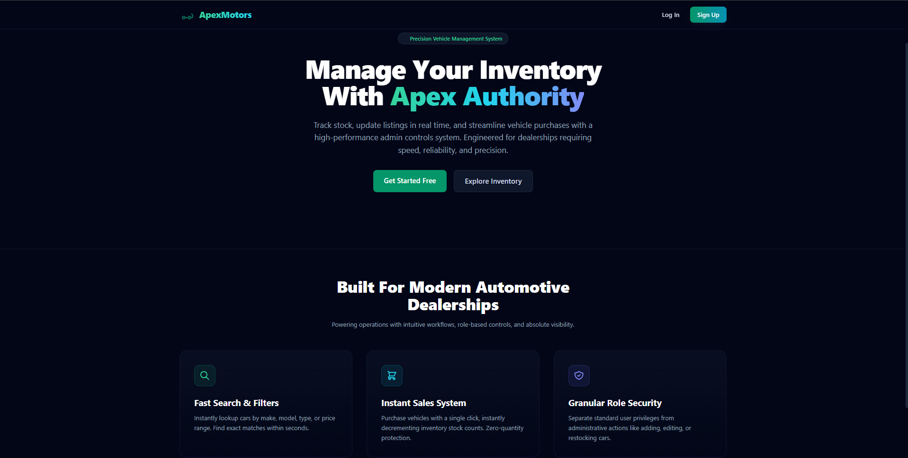
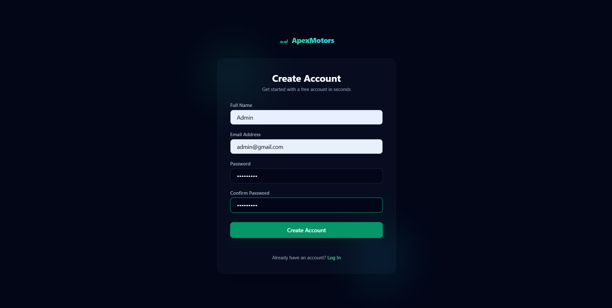
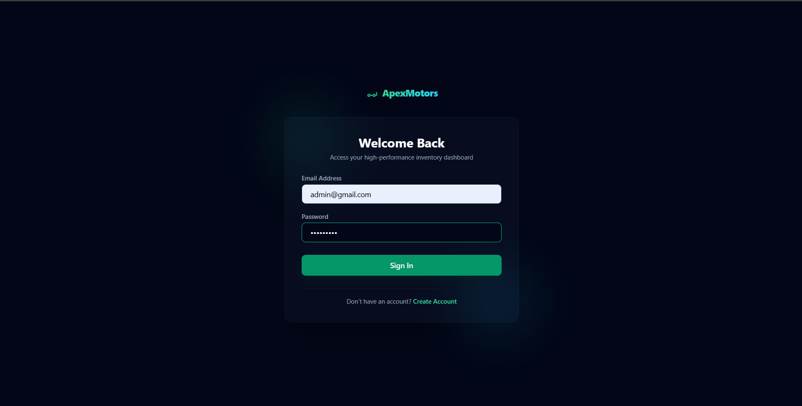
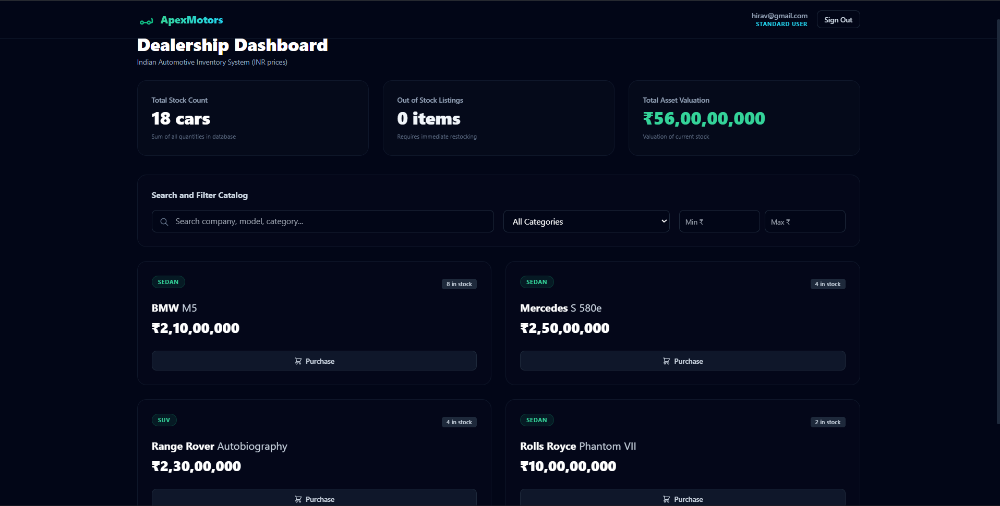
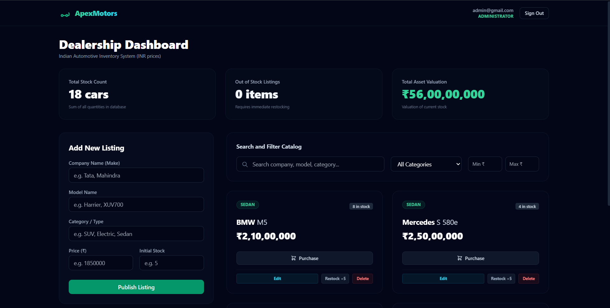

# Car Dealership Inventory System

A modern, full-stack Car Dealership Inventory System built with Test-Driven Development (TDD) best practices. The project includes a robust Node.js/Express API backend connecting to a MongoDB database, and a highly polished single-page application (SPA) frontend in React styled with a professional dark theme and custom glassmorphism components.

---

## Technical Stack

- **Backend**: Node.js, Express, MongoDB, Mongoose, JSON Web Tokens (JWT), BcryptJS.
- **Frontend**: React, React Router v7, Axios, Tailwind CSS, PostCSS, Vite.
- **Testing**: Jest, Supertest (backend integration), React Testing Library (frontend).
- **Tooling**: Babel (transpilation inside JSDOM/Jest), Nodemon.

---

## Features

- **Granular User Roles**: Role-based access control supporting standard **Users** (can browse, search, and purchase vehicles) and **Administrators** (can also add new vehicles, update vehicle details, restock vehicles, and delete listings).
- **Full Name Registration**: Secure signup incorporating user full names in the database schema.
- **Unified Auth State**: Protected routing guards blocking unauthorized accesses and automatically keeping standard users away from administrative panels.
- **Dynamic Catalog Controls**: Fast search queries by company brand, model, and category alongside filter bounds for minimum and maximum price ranges.
- **Indian Rupees (₹) Pricing**: Native display format using local standard INR notations (e.g. ₹45,000) for all currency attributes.
- **Inventory Sales protection**: "Purchase" click decrements vehicle quantities in real time and automatically locks inputs/actions if inventory drops to zero (out of stock).

---

## Directory Structure

```text
├── backend/
│   ├── src/
│   │   ├── config/          # Database connection configs
│   │   ├── controllers/     # Request handlers for auth and vehicles
│   │   ├── middlewares/     # Protect & Admin authorization filters
│   │   ├── models/          # Mongoose User and Vehicle schemas
│   │   ├── routes/          # Express route setups
│   │   └── services/        # Business logical operations
│   └── tests/               # Backend Jest integration and unit test suites
│
├── frontend/
│   ├── src/
│   │   ├── api/             # Axios client with authorization interceptors
│   │   ├── pages/           # Pages (Landing, Login, Register, Dashboard)
│   │   └── App.jsx          # Router paths & Auth state management
│   └── jest.config.cjs      # Jest testing configs
│
└── public/                  # Product UI flow demonstration photos
```

---

## Setup & Local Run Guide

### 1. MongoDB Database Setup
Ensure you have a local MongoDB daemon running. The default connection URI is:
- Development: `mongodb://127.0.0.1:27017/car-dealership`
- Testing: `mongodb://127.0.0.1:27017/car-dealership-test`

### 2. Backend Server Setup
Navigate into the `backend/` directory, create a `.env` file referencing variables below, install packages, and start the development server:

```bash
# Set environment values in backend/.env
PORT=5000
MONGO_URI=mongodb://127.0.0.1:27017/car-dealership
MONGO_TEST_URI=mongodb://127.0.0.1:27017/car-dealership-test
JWT_SECRET=super_secret_jwt_key_for_dealership

# Install packages
cd backend
npm install

# Start Nodemon Dev server
npm run dev
```
The backend server will run on `http://localhost:5000`.

### 3. Frontend React Setup
Navigate into the `frontend/` directory, install packages, and run the Vite dev server:

```bash
cd ../frontend
npm install

# Run Vite dev server
npm run dev
```
The frontend SPA will run on `http://localhost:5173`.

---

## Running Test Suites

### Backend Tests
Execute the Jest integration and unit tests for controllers, models, and auth filters:
```bash
cd backend
npm run test:report
```

### Frontend Tests
Execute the Jest unit tests for components:
```bash
cd frontend
npm test
```

---

## Application Screenshots

### 1. Landing Page
Clean, centered hero message with quick access links to sign up or explore.


### 2. Registration Page
User account signup incorporating Full Name input.


### 3. Login Page
Secure user log in.


### 4. Standard User Dashboard
View catalog, search listings, select categories, set price bounds (₹), and purchase vehicles.


### 5. Admin Dashboard
Administrative privileges containing options to Restock, Edit details, Delete listings, and Publish new vehicles.


---

## My AI Usage

### AI Tools Utilized
- **Gemini**: Used as the AI coding assistant for test suite generation inside the backend.
- **Antigravity**: Used as the pair-programming AI coding assistant for the frontend application design and development.

### Division of Work
- **Developer Contributions**: The Express backend structure, schemas (User and Vehicle models), services, API controllers, middlewares, and router mappings were created entirely by the developer manually (excluding the testing files).
- **Gemini AI Contributions**: Built all the backend Jest files under the `backend/tests/` folder. This included unit testing for `authMiddleware` and integration testing for authentication endpoints (`auth.test.js`) and inventory endpoints (`vehicles.test.js`).
- **Antigravity AI Contributions**: Engineered the entire `frontend/` part of the repository from scratch. This involved:
  - Setting up configs (`package.json`, `tailwind.config.js`, `postcss.config.js`, `babel.config.cjs`, `jest.config.cjs`, `jest.setup.js`).
  - Creating mock assets and layouts.
  - Setting up Axios routing interceptors, React Router pathways, and Protected Routing Guards.
  - Designing UI pages (`Landing.jsx`, `Register.jsx`, `Login.jsx`, `Dashboard.jsx`) with dark layouts and Indian Rupee formatting.
  - Creating unit tests (`Login.test.jsx`, `Register.test.jsx`) and setting up global `TextEncoder` JSDOM variables to ensure compile validations pass.

### Impact Reflection
Integrating AI tools greatly improved execution speed and development cycle times:
- Gemini automated the creation of integration tests, allowing us to catch schema validations (like database hook promise resolutions) before deployments.
- Antigravity translated Express backend specifications into a working React SPA with cohesive styling, handling configurations (Babel/Jest for React 19) that usually introduce developer friction.
- This hybrid collaborative workflow allowed the developer to focus on structuring API logic and roles while relying on AI to write test configurations and build high-quality UI views.